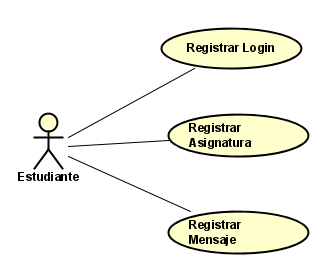
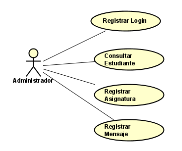
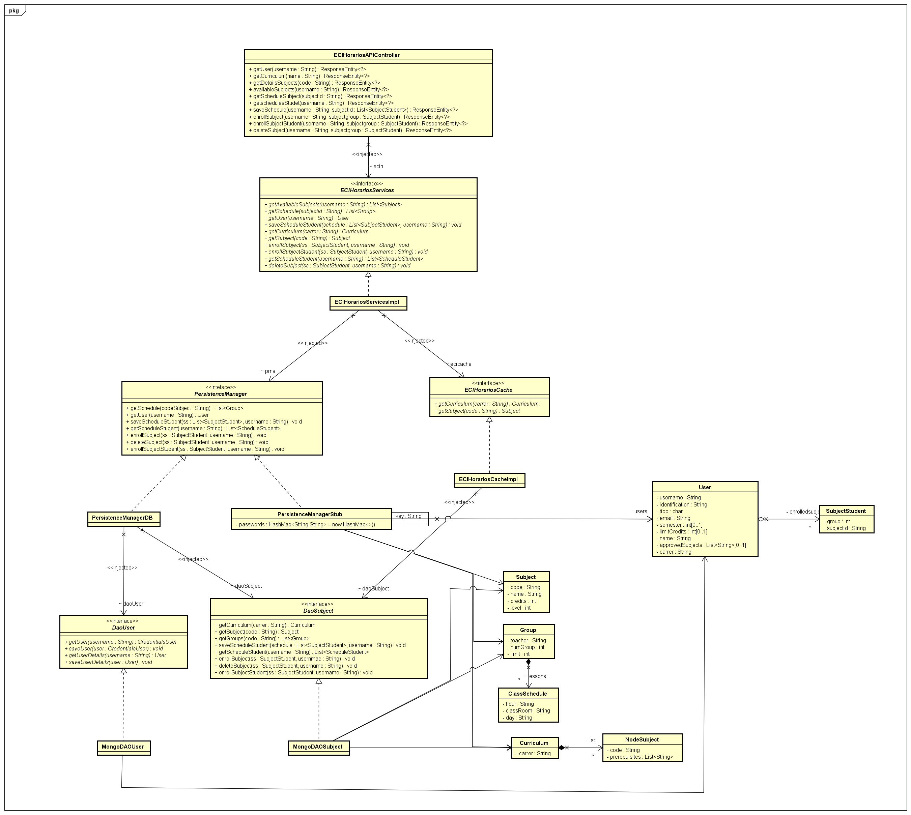
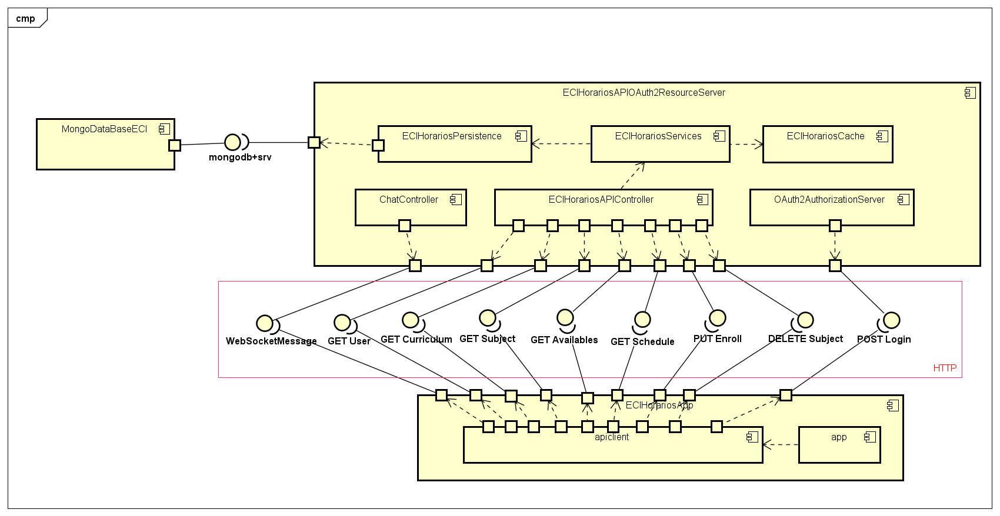

# ***Software Development Industries***
## ***Eci-Horarios***

  - **Periodo Académico**: 2021-1
  - **Curso**: Arquitectura de Software
  - **Profesor**: Diego Alfonso Prieto Torres
  
  
- **Integrantes**:
  - David Coronado Gómez
 

### Asignación de roles:
|     Nombre    |     Rol         |
|--------------|------------- |
|Diego Alfonso Prieto	|Product Owner    |
|David Coronado	|Scrum Master    |

 

 
  ## Descripción General
 
Es un herramienta desarrollada por el grupo de desarrolladores “Software Development Industries” la cual se encarga de mejorar el servicio que presta la universidad para la asignación y creación de horarios para la escuela colombiana de ingeniería. Para ello se planteó y creo una plataforma innovadora que cumplirá con los requerimientos de los estudiantes y solucionará las falencias de la plataforma actual usada, para ello se creo un aplicativo web que permitirá hacer uso de varios usuarios para cumplir con los requerimientos para realizar horarios. 

La plataforma esta planteada como una herramienta nueva para realizar horarios, la cual tendrá como plus  permitir comunicarse con el un administrador para que le tramite sus peticiones al estudiante.

#### Despliegue  ECIHorariosApi
> 

#### Despliegue  ECIHorariosApp 
> 

#### Integración Continua con CircleCI
>

#### Calidad del Codigo con Codacy

>

[link repositorio ECIHorariosApp](https://github.com/davinchicoronado/ECIHorarios-App)

## **Arquitecura y Diseño**
### Casos de uso  

####  Estudiante 
 

##### Registrar Login 
* Como estudiante quiero iniciar sesion en la plataforma para poder realizar diferentes operaciones referente a la inscripción de horarios.
   
##### Registrar Asignatura 

* Como estudiante quiero registrar una asignatura para poder verla en el actual semestre. 

  - Consultar las asignaturas disponibles para el estudiante. 
  - Agregar una asignatura . Restricciones : El estudiante no podrá inscribir asignaturas que no tengan cupos y no podrá exeder el número de creditos disponibles para        él.
  - Eliminar alguna asignatura inscrita.

##### Registrar mensaje 
* Como estudiante quiero enviar mensajes al admnistrador del area encargada para poder solucionar mis dudas o realizar solicitudes. 

####  Administrador 
 

##### Registrar Login 
* Como administrador quiero iniciar sesión en la plataforma para poder responder las  diferentes solicitudes de los estudiantes referente a la inscripción de horarios. 

##### Consultar Estudiante 
* Como administrador quiero consultar la información de un estudiante para poder realizar un debido proceso en cuanto a sus solicitudes.

##### Registrar Asignatura 
* Como administrador quiero registrar una asignatura del estudiante para poder responder a su solicitud. 

#### Registrar Mensaje 
* Como administrador quiero enviar mensajes a los estudiantes para poder responder a sus solicitudes. 

### Diagrama de Clases

### Diagrama de Componentes 

       
